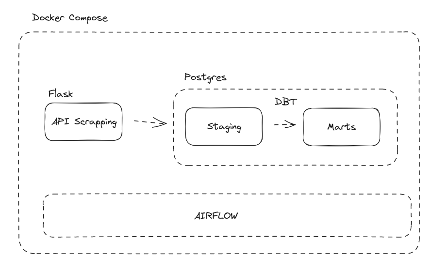

# Supermarket
Project to store and analyse prices from supermarkets in Rio de Janeiro


### Architeture


This is a comprehensive software architecture for collecting, storing, transforming, and providing access to supermarket data. The solution utilizes various technologies to automate the entire data flow, from obtaining information from supermarket APIs to storing and providing clean and transformed data in a Postgres database.

## Architecture Components

### Flask API

A Flask API has been developed to provide routes that allow obtaining supermarket data. These routes may include information about products, prices, availability, and more. The API acts as the interface to retrieve the necessary data for the collection process.

### Postgres Database

The Postgres database is used as the primary repository to store both raw and transformed data. The database structure consists of two distinct schemas:

- **Staging**: This schema is used to store the raw data collected directly from the API. The data may contain duplicates and inconsistencies and serves as the starting point for the transformation process.

- **Marts**: This schema is used to store the transformed and clean data after going through the transformation process using DBT. The data in this schema is ready to be used by other applications and analyses.

### DBT (Data Build Tool)

DBT is a data transformation tool used to process the raw data stored in the "Staging" schema of the Postgres database. DBT allows defining rules, models, and aggregations that transform the data into a more suitable format for use in various analyses and reports.

### Airflow

Airflow is a workflow orchestration platform that automates the entire process, from collecting data from the API to executing transformations in DBT and loading data into the "Marts" schema of the Postgres database. Airflow enables creating a Directed Acyclic Graph (DAG) that visually represents the flow of tasks and their dependencies.

### Docker Compose or Kubernetes

To facilitate the deployment and management of the entire infrastructure, Docker Compose or Kubernetes can be used. These tools allow packaging and running each component of the architecture in isolated containers, ensuring portability and scalability of the solution.

## Configuration and Execution

To configure and run the architecture, follow the specific instructions in each component (Flask API, Postgres, DBT, and Airflow) and use Docker Compose or Kubernetes to manage the necessary containers.

## How to use

### With docker compose

Make sure you have docker and docker compose installed

```

docker-compose up -d

```

### With Kubernetes

Make sure you have helm and airflow chart installed

```

kubectl create namespace airflow
kubectl apply -f infra/db/datalake-svc.yaml -n airflow
kubectl apply -f src/api-svc.yaml -n airflow
kubectl helm install airflow apache-airflow/airflow -f infra/airflow/values.yaml -n airflow

```

## Contribution

This project is an example of a software architecture and is not complete. Feel free to contribute, provide feedback, or make improvements to make it more robust and suitable for your needs.

